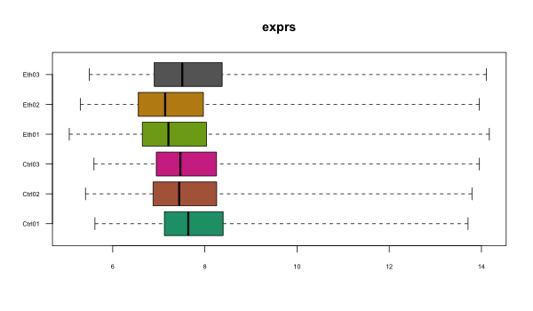

```{r setup, include=FALSE}
knitr::opts_chunk$set(echo = TRUE)
```

```{r, echo=FALSE}
## Some functions I'm gonna use
maybe_round <- function(x, thr){
  
  if (round(x, thr) == 0){
    x <- round(x, 10)
  }
  else{
    x <- round(x, thr)
  }
}
```


```{r, message=FALSE, echo=FALSE}
library(Biobase)
```

# Introducció

L'objectiu de la PAC 2 és la realització d'un anàlisi de dades de microarray d'un *dataset* obtingut del repositori públic d'NCBI **_Gene Expression Omnibus_** (**_GEO_**, [@Edgar2002]).

En aquesta PEC, intentaré demostrar que he anat assolint els coneixements que s'han exposat al contingut de l'assignatura Anàlisi de Dades Òmiques fins ara, concretament referent als mòduls 1 i 2 de l'assignatura.

El exercici, doncs, consistirà en descarregar un conjunt de dades del repositori de GEO utilitzant el conjunt d'eines de `BioConductor`, el *fitteig* d'un model lineal amb `limma` que ens permeti realitzar contrasts entre els grups d'interès biològic, i l'obtenció a partir d'aquest model dels gens diferencialment expressats en un format **llista**.

A partir d'aquesta llista, podrem dur a terme el que es coneix com a l'anotació d'aquests gens, que ens permetrà extreure informació relativa als potencials processos biològics que poden veure afectats amb la presència o absència d'una determinada covariable. Això ho podem fer de diverses maneres, entre les quals destaquen el **_Over Representation Analysis_** (***ORA***) i el **_Gene Set Enrichment Analysis_** (**_GSEA_**).

```{r, echo=FALSE, eval=F}
require(GEOquery)

gds <- getGEO('GDS2107')
remove(gds)
```

A continuació, descarrego les dades amb les que treballaré en aquesta PEC. Aquestes corresponen a la sèrie `GSE3311`, que formen part de l'estudi de @Kubisch2006. En aquest estudi, els autors van intentar mesurar els gens involucrats en la sensibilització del pàncrees que s'ha observat davant de consumició d'etanol a llarg termini.

```{r, cache=TRUE, message=FALSE}
require(GEOquery, quietly = T)
gse <- getGEO('GSE3311', GSEMatrix = TRUE, getGPL=TRUE)
```

Degut a que les dades descarregades no estan *log-transformed*, i aquestes dades contenen valors d'expressió negatius que al aplicar-se la transformació logarítmica generen `NaNs`, he decidit per descarregar-me les dades *raw* (.CEL) de la pàgina web de GEO i llavors aplicar la transformació jo mateix. Deixo a l'apèndix la demostració de que això que dic és veritat.

```{r, cache=TRUE, message=FALSE, warning=FALSE}
require(oligo)
celfiles <- list.files('rawdata')
rawData <- read.celfiles(file.path('rawdata', celfiles), verbose=FALSE)
pData(rawData) <- pData(gse[[1]])
```

També copio el *slot* `phenoData` de l'objecte de tipus `GSE` obtingut amb `GEOquery` per tal de no perdre la informació relativa a les mostres.

A l'article relacionat amb aquest conjunt de dades, els autors detallen com a principal aportació del seu treball l'utilització d'un model de tractament amb etanol a llarg termini (~8 setmanes) per a evaluar l'expressió basal diferencial de gens al pàncrees.

Entre els gens que observen com a diferencialment expressats (DE), un considerable número d'aquests participen en processos relacionats amb l'estrès oxidatiu i del reticle endoplasmàtic, el citoesquelet, el metabolisme del folat i l'anomenat tripsinogen. Així doncs, un dels altres objectius que tinc en aquest exercici és comprovar la robustesa dels seus resultats amb mètodes (entenc que) més recents (ja que fa 17 anys de la publicació de l'article).

# Materials i mètodes

## *Dataset*

El *dataset* escollit per a la realització d'aquesta PEC és el dataset amb *Accession ID* `GDS2107` o, per altra banda, la sèrie amb *Accession ID* `GSE3311` (@Kubisch2006). 

Aquest estudi va separar dos grups de rates (*Rattus norvegicus*), a un dels quals se l'hi va donar etanol durant 8 setmanes, moment en el qual van ser *eutanitzades* i el pàncrees extret per al seu anàlisi. Posteriorment, es va homogeneïtzar el teixit pàncreatic de 3/4 rates per grup experimental, i aquest homogeneïtzat és el que va ser analitzat al *microarray*.

És a dir, entenc que les 6 mostres són rèpliques tècniques provenent 3 del homogeneïtzat del grup control i 3 del homogeneïtzat del grup tractat amb etanol.

Utilitzant el *slot* de l'`ExpressionSet` anomenat `phenoData`, podem extreure informació molt valuosa referent al *dataset* `GDS2107`. Per exemple, podem esbrinar el número de canals (i també si totes les mostres tenien el mateix número de canals).

```{r, message=FALSE}
unique(pData(rawData)$channel_count)
```

Veiem que totes les mostres tenen només un canal.

```{r wistar-rat}
unique(pData(rawData)$characteristics_ch1)
```

Per altra banda, les mostres provenen totes de rates de tipus Wistar, i també interessant, totes eren mascles (no tenim sexe com a covariable).

```{r, echo=F, message=FALSE, warning=F}
require(dplyr); require(kableExtra)
knitr::kable(pData(rawData)[, c(1,31)], 
             caption = 'Nom, descripció i número de files de cada mostra')
```

A més podem veure el tractament i rèplica al que pertany cada *sample*. Amb aquesta informació, canvio el nom de les columnes de l'`ExpressionSet` per tal de que siguin més informatives.

```{r}
colnames(rawData) <- paste(c(rep("Ctrl", 3), rep('Eth', 3)), c("01", "02", "03"),
                            sep='')
```


## Eines de `BioConductor` [@huber2015]

### `GEOquery` [@geoquery2007]

Com he mencionat abans, GEOquery és un paquet que permet la interacció amb el repositori de dades d'NCBI **_Gene Expression Omnibus_**. D'aquesta manera, permet descarregar fàcilment conjunts  de dades directament des de R, obtenint-les en formats compatibles amb els altres paquets de `BioConductor`.

### `limma` [@limma2015]

Per a dur a terme els anàlisis estadístics de les dades del *microarray*, i.e. l'ànalisi de gens diferencialment expressats entre els grups experimentals, utilitzarem el paquet `limma`, que permet ajustar models lineals en gran conjunts de dades com els microarrays. 

### `arrayQualityMetrics` [@aQM2009]

El paquet `arrayQualityMetrics` permet realitzar un control de qualitat de dades de *microarray* de manera fàcil, mitjançant l'ús de bàsicament una única funció. Guarda els resultats (imatges i un fitxer `html` que facilita la comprensió del QC amb interpretacions dels gràfics que es generen) a un directori que l'usuari especifica.

### `rae230a.db` [@rae230a2021]

Paquet que conté les anotacions referents al xip d'Affymetrix RAE230A, que s'ha utilitzat en l'experiment de @Kubisch2006 i en aquest exercici/PEC. Conté el *mapeig* entre les sondes d'aquesta tecnologia de *microarray* i els símbols, ENTREZID i altres IDs corresponents a les principals fonts d'anotacions genòmiques.

### `genefilter` [@genefilter2023]

Per a realitzar el filtratge preliminar de gens, utilitzarem el paquet `genefilter`. Aquest paquet permet utilitzar diferents criteris per a descartar gens que potencialment no ens interessen. Aquests criteris solen estar relacionats a la variabilitat que mostren els gens, si tenen una anotació a ENTREZ, o altres.

Aquest tipus de filtratge es sol dir no específic. Es defineix com a filtratge específic aquell que està relacionat amb els grups experimentals (i.e. que no està diferencialment expressat (DE) en els dos -- o més -- grups experimentals). En canvi l'inespecífic és el que no està relacionat amb aquests criteris (d'acord a la `vignette` del paquet).

### `oligo` [@oligo2010]

El paquet `oligo` conté diverses funcions clau per a la lectura i pre-processat de les dades de *microarray*. Entre d'altres, permet llegir arxius de tipus .CEL (el format *raw* de chips d'Affymetrix), i implementa la funció principal de normalització de *microarrays* `rma` (*Robust Multichip Average algorithm*).

### `clusterProfiler` [@Wu2021]

El paquet `clusterProfiler` té com a objectiu implementar els principals mètodes d'*enrichment analysis* funcional en `R`, incorporant informació i anotacions sobre ontologies corresponents a un número considerable de organismes com ratolins, humans i rates.

### `msigdbr` [@msigdbr2022]

Paquet relacionat amb la *Molecular Signatures Database* (MSigDB) que conté anotacions de *gene sets* de diferents espècies, especialment preparat per a la seva utilització en anàlisi GSEA.

## Disponibilitat del codi amb el que s'ha generat aquest document

El codi que he fet servir per a generar aquest document està disponible a: https://github.com/vcasellesb/PEC2-Analisis-Dat-Omic.

# Resultats i discussió

## Control de qualitat

Per a dur a terme el control de qualitat, faig servir la funció `arrayQualityMetrics`. He seleccionat quatre gràfics que contenen informació rellevant referent al control de qualitat.

```{r, warning=FALSE, cache=TRUE, message=FALSE, echo=F}
rerun=F
if (rerun){
require(arrayQualityMetrics)
arrayQualityMetrics(rawData, outdir='report_exprsdata', force=T)
}
```

```{r arrayQM, echo=FALSE, fig.show="hold", out.weight="49%", out.height="20%", fig.cap="Control de qualitat mitjançant ArrayQualityMetrics", fig.align='center'}
knitr::include_graphics(c('report_exprsdata/hm.png', 'report_exprsdata/msd.png', 
                          'report_exprsdata/dens.svg', 'report_exprsdata/box.png'))
```

Com podem veure a la figura \@ref(fig:arrayQM), els boxplots clarament demostren que les dades no estan normalitzades. També he realitzat un *boxplot* "manualment" (fig. \@ref(fig:boxplot-vicent)), que corrobora aquesta afirmació.

```{r, eval=FALSE, echo=F}
png(file='images/boxplot.png', 600, 350)
boxplot(rawData, which='all', cex.axis=0.6, 
        names = colnames(rawData), las=1, horizontal=TRUE)
dev.off()
```

```{r boxplot-vicent, fig.cap="Boxplot de les intensitats de les diferents mostres", out.width='60%', fig.align="center", echo=FALSE}

```


Utilitzant el codi del professor de l'assignatura (concretament, el de https://github.com/ASPteaching/Analisis_de_datos_omicos-Ejemplo_0-Microarrays), realitzaré un gràfic de les dues components principals.

```{r echo=FALSE}
plotPCA <- function ( X, labels=NULL, colors=NULL, dataDesc="", scale=FALSE)
{
  pcX<-prcomp(t(X), scale=scale) # o prcomp(t(X))
  loads<- round(pcX$sdev^2/sum(pcX$sdev^2)*100,1)
  xlab<-c(paste("PC1",loads[1],"%"))
  ylab<-c(paste("PC2",loads[2],"%"))
  if (is.null(colors)) colors=1
  plot(pcX$x[,1:2],xlab=xlab,ylab=ylab, col=colors, 
       xlim=c(min(pcX$x[,1])-quantile(pcX$x[,1], 4/6), 
              max(pcX$x[,1])+quantile(pcX$x[,1], 4/6)),
       ylim=c(min(pcX$x[,2])-quantile(pcX$x[,2], 4/6), 
              max(pcX$x[,2])+quantile(pcX$x[,2], 4/6)),
       )
  text(pcX$x[,1],pcX$x[,2], labels, pos=3, cex=0.8)
  titulo <- ifelse(dataDesc=="", "PCA Plot", 
                   dataDesc)
  title(titulo, cex=0.8)
}
```

```{r pca-graph, out.width='60%', fig.align='center', fig.cap="Resultat de graficar les dues principals components de les dades del 'nostre' experiment", echo=FALSE}
plotPCA(exprs(rawData), labels=colnames(rawData))
```

La figura \@ref(fig:pca-graph) ens permet comprovar si les mostres (o l'expressió que podem observar en aquestes) es comporten com esperaríem, mitjançant un potencial clustering d'acord a les dues components principals (les que expliquen més variabilitat del conjunt de dades). Com podem observar, les mostres es no es disposen de cap manera que podria ser lògica d'acord al grup al que pertanyen. Això demostra la necessitat de normalitzar les dades, fet que faré a continuació.

## Normalització de les dades

Per a normalitzar les dades, utilitzaré la funció `rma` del paquet `oligo`.

```{r normrma, message=FALSE}
require(oligo)
eset <- rma(rawData)

featureData(eset) <- featureData(gse[[1]])
```
Una vegada tenim les dades d'expressió normalitzades, copio la informació referent als gens, també anomenada `featureData`, de l'objecte `gse` que he creat abans amb el paquet `GEOquery`.

```{r norm, out.width='100%', fig.align="center", fig.cap="Demostració de l'efectiva normalització de les dades d'expressió", echo=FALSE}

par(mfrow=c(1,2))
boxplot(eset,main="Boxplot",
        names=colnames(eset), cex.axis=0.7,las=2, horizontal=TRUE)

plotPCA(X=exprs(eset), labels=colnames(eset))
```

Tal i com observem a la figura \@ref(fig:norm), les dades ara si que podem considerar que estan correctament normalitzades.

## Filtrat de gens no específic

Per a realitzar el filtratge de gens no específic, utilitzaré la funció `nsFilter` de `genefilter`. Dintre dels criteris que podem triar, utilitzaré aquells que he vist en els materials de l'assignatura. Quasi sempre es filtren aquells gens que presenten una variabilitat baixa (mesurada amb el `IQR`, o *Inter Quantile Range*), i també aquells gens que no estan anotats a ENTREZ.

```{r, message=FALSE}
require(genefilter)
annotation(eset) <- 'rae230a.db'
if (!require(annotation(eset), character.only = T)) 
  BiocManager::install(annotation(eset))
filtered_eset = nsFilter(eset, var.func=IQR, var.cutoff=0.75, var.filter=TRUE, 
                         require.entrez=TRUE, filterByQuantile=TRUE)
```

Com veieu, he marcat com a anotació per al filtratge el paquet `rae230a.db`, que és paquet associat al tipus de *chip* que s'ha utilitzat en aquest experiment, segons la pàgina web de GEO. Com veieu, filtrem els gens (o *probes*, *features*) que presenten un IQR (el quantil 0.75 menys el 0.25) menor al IQR que deixa un 75% de IQRs per sota d'aquest. Així doncs, estem descartant un 75% de les dades amb menor variabilitat (definida per IQR).

```{r}
filtered_eset$filter.log
```

Com podem veure, el número de *probes* filtrades per "LowVar" és `r filtered_eset$filter.log$numLowVar`. Això inicialment m'ha fet pensar que algo havia fet malament, ja que `filtered_eset$filter.log$numLowVar/nrow(eset) == `  `r round(filtered_eset$filter.log$numLowVar/nrow(eset), 2)`. Però, llegint més atentament la documentació de `nsFilter`, trobem que el filtratge de gens degut a la variança es duu a terme en últim lloc, així que el càlcul hauria de ser el següent: `filtered_eset$filter.log$numLowVar/(nrow(eset) - filtered_eset$filter.log$(numDupsRemoved, numRemoved.ENTREZID, feature.exclude))`. És a dir, hauríem de fer la divisió amb el denominador resultant de fer el filtratge d'acord a tots els altres criteris excloent la variança. Això dóna: `r round(filtered_eset$filter.log$numLowVar / (nrow(eset) - (filtered_eset$filter.log$numRemoved.ENTREZID + filtered_eset$filter.log$feature.exclude + filtered_eset$filter.log$numDupsRemoved)), 2)`.

Així doncs, s'ha fet el filtratge de manera satisfactòria. Veiem que hem perdut un total de `r sum(filtered_eset$filtered.log)`. Concretament, degut al criteri de variança baixa s'han filtrat `r filtered_eset$filter.log$numLowVar`; pel criteri de filtratge de sondes conegudes com a sondes de control de qualitat d'Affymetrix s'han exclòs `r filtered_eset$filter.log$feature.exclude`; pel criteri d'exclusió de sondes no anotades per ENTREZ s'han deixat enrere `r filtered_eset$filter.log$numRemoved.ENTREZID`; i, finalment, en quant a sondes duplicades s'han filtrat `r filtered_eset$filter.log$numDupsRemoved` sondes.

## *Fitteig* del model lineal

Ara, procedeixo a generar l'objecte corresponent al model lineal que utilitzaré per a trobar els gens diferencialment expressats. Per a això utilitzem el paquet popular `limma`. Creo una matriu de disseny molt facileta, amb dos columnes (una per a cada coeficient corresponent als nivells del factor "tractament" (Control, i tractat amb etanol)), i el mateix número de files com mostres hi ha a l'`ExpressionSet`.

```{r, message=FALSE}
require(stringr); require(limma)
myeset <- filtered_eset$eset
groups <- str_replace_all(colnames(myeset), "[:digit:]", "")

design <- model.matrix(~0 + factor(c(1,1,1,2,2,2)))
colnames(design) <- unique(groups)
rownames(design) <- colnames(exprs(myeset))
show(design)
```
Un cop preparada la matriu de disseny, podem realitzar el *fit* del model, amb la funció `lmFit`.

```{r, message=FALSE}
require(limma)
fit <- lmFit(myeset, design)
```

Ara, ja que ens interessa comprovar en quins gens hi ha diferències significatives entre els dos grups experimentals, crearem una matriu de contrast que faci aquesta comparació. Com que només tenim un factor amb dos nivells, el número de contrasts només serà 1.

```{r}
contrast.matrix <- makeContrasts(Eth - Ctrl, levels=design)
show(contrast.matrix)
```
Un cop ho tenim tot preparat, podem procedir a realitzar els contrasts per al model que hem ajustat prèviament. Aplicarem la funció `eBayes`, que permet obtenir *t-stats*, *F-stats* i *log-odds* "moderats" mitjançant tècniques d'estadística Bayesiana, tenint en compte la variança global de tots els gens del *microarray*. 

```{r, message=FALSE}
require(limma)
fit2 <- contrasts.fit(fit, contrast.matrix)
fit2 <- eBayes(fit2)
```

Un cop fet això, podem obtenir la taula amb els gens ordenats segons la seva expressió diferencial, donada pel *B-statistic* o el *p-value*, mitjançant la funció `topTable`. Utilitzem el mètode *False Discovery Rate*, altrament dit mètode *Benjamini-Hochberg*, per a ajustar per a tests múltiples.

```{r}
topTabCtrlvsEth <- topTable(fit2, number=nrow(fit2), coef="Eth - Ctrl", adjust="fdr")
head(topTabCtrlvsEth[, c("Gene.Symbol", "ENTREZ_GENE_ID", "logFC", "adj.P.Val", "B")])
simbls = rownames(topTabCtrlvsEth)
```

Degut a que he copiat la informació de l'*slot* `featureData`, ja tenim informació sobre els gens (*Symbols*, per exemple) als que corresponen les sondes del *microarray*, que prové del repositori GEO. Però, degut a que l'anotació d'aquest repositori considero que hi ha major probabilitat de què estigui més desactualitzada que els paquets de `BioConductor`, anotaré "manualment" la taula jo.

A continuació, mostro un dels motius pels que considero que l'anotació de GEO no és perfecta.

```{r}
sum(topTabCtrlvsEth$Gene.Symbol=="")
```

Veiem que hi ha 113 símbols buits.

## Anotació de la llista de gens

Per a anotar la `topTabCtrlEth`, utilitzo la funció `annotatedTopTable` que utilitza el professor de l'assignatura als apunts, juntament amb el paquet corresponent al *microarray* de Affymetrix "rae230A".

```{r, echo=FALSE, warning=FALSE, message=F}
annotatedTopTable <- function(topTab, anotPackage){
  topTab <- cbind(PROBEID=rownames(topTab), topTab)
  myProbes <- rownames(topTab)
  thePackage <- eval(parse(text = anotPackage))
  geneAnots <- AnnotationDbi::select(thePackage, myProbes, c("SYMBOL", "ENTREZID", "GENENAME"))
  annotatedTopTab<- merge(x=geneAnots, y=topTab, by.x="PROBEID", by.y="PROBEID")
  annotatedTopTab <- annotatedTopTab[order(annotatedTopTab$B, decreasing=TRUE), ]
return(annotatedTopTab)
}
```

```{r, message=FALSE, warning=FALSE}
require(rae230a.db)
topTabCtrlvsEth_annot <- annotatedTopTable(topTabCtrlvsEth, annotation(eset))

head(topTabCtrlvsEth_annot[, c("SYMBOL", "adj.P.Val", 't', 'logFC')])

simbols2 = topTabCtrlvsEth_annot$PROBEID
stopifnot(all(simbls==simbols2)) 
```

Provem fàcilment que aquesta "nova" anotació deixa menys sondes buides a continuació.

```{r}
sum(topTabCtrlvsEth_annot$SYMBOL=="")
```


Podem fer una primera visualització dels resultats amb la confecció d'un *volcano plot* (fig. \@ref(fig:volcanoplot)).

```{r volcanoplot, fig.align="center", fig.cap="Volcano plot que permet visualitzar el fold change (significació biològica) davant de la significació estadística dels contrasts del nostre model", echo=FALSE}
volcanoplot(fit=fit2, coef=1, highlight=10, names=fit2$genes$`Gene Symbol`,
            main="Volcano plot resultat del nostre fit")
abline(v=c(-1, 1))
```

Després d'obtenir aquesta taula, podem obtenir un vector o llista amb els gens expressats diferencialment mitjançant la funció `decideTests` del paquet `limma`. A l'article utilitzen com a *threshold* un logFC de 3.0 i un p-valor de 0.05, i es queden amb 114 gens. Cal destacar que:

* 1. El mètode de normalització no ha sigut el mateix (més sobre això a l'apèndix).
* 2. Ells reporten p-valor sense ajustar obtingut d'un *two-sample t-test*.

```{r}
results<-decideTests(fit2, adjust.method="fdr", p.value=0.05, lfc=3)
summary(results)
```
Ja que, com veiem, si intento replicar aquests resultats amb l'ajustament que fem nosaltres a l'assignatura, no obtenim cap sonda que compleixi aquests criteris. D'aquesta manera, aplicaré uns criteris més laxos, és a dir, un |logFC| de 1.

```{r}
results<-decideTests(fit2, adjust.method="fdr", p.value=0.05, lfc=1)
summary(results)
```
Podem observar que el número de gens que mostren *up-regulation* són 13, mentre que els que mostren *down-regulation* són 16.

Em guardo els símbols i entrezID d'aquests gens que mostren expressió diferencial (*up* i *down*)

```{r}
res.selected = results[results@.Data[, 1]!=0, ]
res.selected.symbol = unlist(mget(rownames(res.selected), rae230aSYMBOL))
res.selected.entrez = unlist(mget(rownames(res.selected), rae230aENTREZID))
res.selected = cbind(res.selected.symbol, res.selected.entrez,
                     vapply(topTabCtrlvsEth[rownames(res.selected),]$logFC,
                            FUN=maybe_round, FUN.VALUE=numeric(1), thr=2))
show(res.selected)
```

En aquesta taula, podem veure els principals gens diferencialment expressats amb els criteris de selecció que he utilitzat (|logFC|>1, aj.p-valor < 0.05), i veiem alguns dels gens que reporten els autors al seu article i que seleccionen per a un anàlisi quantitatiu més precís amb RT-PCR. Aquests són **Atf3**, **Hspa1a**, **Hspb1** i **Mt2a** (encara que a l'article identifiquen Mt1a). Veiem també que hi ha una correlació entre el logFC "meu" i el FC reportat pels autors (@Kubisch2006, figura 1). Hi ha altres gens que ells reporten, que potser se'm escapen, degut a, per exemple, canvis en la nomenclatura dels *gene symbols*. Per exemple, sospito que el que ells anomenen *Pap* (*Pancreatitis Associated Protein*) és ara considerada de la família *Reg* (com Reg3a, Reg1a i Reg3b). És més, buscant el UNIGENE ID per a Pap que reporten a l'article, no es troba cap resultat.

Podem utilitzar aquesta matriu per a realitzar un heatmap, que ens pot donar informació sobre els patrons de sobre i sota expressió per a cada un dels gens i de les mostres. La figura \@ref(fig:heatmap-plot) ens permet observar com les mostres s'agrupen d'acord al tractament o grup experimental al que pertanyen.

```{r heatmap-plot, out.width="80%", fig.align="center", message=FALSE, fig.cap="Heat map amb els gens seleccionats a partir de la nostra top table"}
require("gplots")
exprs2cluster <-exprs(myeset)[rownames(res.selected),]
colnames(exprs2cluster) <- colnames(myeset)

heat = heatmap.2(exprs2cluster,
          col=bluered(75), scale="row",
          key=TRUE, symkey=FALSE, keysize=1.3,
          density.info="none", trace="none", cexCol=0.8,
          main="DEG w. |logFC|>1 and pval<0.05",   
          cex.main=0.6)
```

També podem observar a la figura \@ref(fig:heatmap-plot) com s'agrupen els gens o sondes més diferencialment expressats. Veiem que a la meitat superior del *heatmap* hi ha un gran bloc de gens que estan *down regulated* per al grup tractat amb etanol, mentre estan *up-regulated* al tractament control. Aquest clúster de gens seria interessant estudiar-se en profunditat.

```{r, message=FALSE, warning=FALSE, fig.pos="H"}
probes_of_interest = rownames(exprs2cluster[heat$rowInd, ])[20:29]

anot_p_of_int = AnnotationDbi::select(x=rae230a.db, keys=probes_of_interest, 
                      columns=c("ENTREZID", "SYMBOL", "GENENAME"))
anot_p_of_int$logFC = vapply(topTabCtrlvsEth[probes_of_interest,]$logFC, 
                             FUN=maybe_round, FUN.VALUE=numeric(1), thr=2)

```

```{r, echo=F}
knitr::kable(anot_p_of_int[, c('SYMBOL', 'GENENAME', 'logFC')], 
      caption="Gens observats al primer cluster del 
      heat map que presenten down-regulation al grup etanol vs control.") %>% 
  kable_styling(latex_options = "HOLD_position")
```

A l'anterior taula podem veure la descripció d'alguns d'aquests gens corresponent al bloc que mencionava del *heatmap*. Podem veure alguna informació potencialment rellevant, com dos gens relacionats a *heat shock proteins* o gens amb la paraula *regenerating* a la descripció (sembla que són subunitats $\alpha$ i $\beta$ d'una familia de proteïnes). Aquestes últimes, segons la web de NCBI, la seva sobre-expressió està relacionada amb la inflamació pancreàtica. Això resulta curiós donat que esperaríem que hi hagués un procés inflamatori al pàncrees en el cas dels ratolins tractat amb etanol.

Tot i això, una búsqueda més profunda revela que Reg3A té múltiples rols en la resposta a la inflamació i el càncer [@Wang2021]. Per una banda, actua com una proteïna que realitza funcions de reparació cel·lular, i promou el creixement i proliferació de les cèl·lules $\beta$ pancreàtiques. En quant a la seva acció envers la inflamació, s'ha observat que l'expressió d'aquest gen és significativament més alta davant de pancreatitis aguda que davant de pancreatitis crònica.

Podem inspeccionar també el segon bloc de gens que mostra una *up-regulation* en el grup etanol respecte al control.

```{r, warning=FALSE}
probes_of_interest = rownames(exprs2cluster[heat$rowInd, ])[12:19]

anot_p_of_int = AnnotationDbi::select(x=rae230a.db, keys=probes_of_interest, 
                      columns=c("ENTREZID", "SYMBOL", "GENENAME"))
anot_p_of_int$logFC = vapply(topTabCtrlvsEth[probes_of_interest,]$logFC, 
                             FUN=maybe_round, FUN.VALUE = numeric(1), thr=2)
```

```{r, echo=F}
knitr::kable(anot_p_of_int[, c('SYMBOL', 'GENENAME', 'logFC')], 
      caption="Gens observats al segon cluster del 
      heat map que presenten up-regulation al grup etanol vs control.") %>% 
  kable_styling(latex_options = "HOLD_position")
```

En quant al segon gran bloc que trobem al heatmap, que inclou 8 gens i que estan tots *up-regulated*, veiem també membres de la familia *Hsp*, i també el gen Atf3, que és el principal gen que reporten els autors al seu article com el gen amb el major *fold change* de tot l'experiment.

## Anàlisi de significació biològica

Em guardo els ID de les sondes dels gens amb un B-stat més gran.

```{r}
probes <- topTabCtrlvsEth[1:5, ]$ID
```

Ara podem utilitzar el paquet d'anotació corresponent al xip de l'experiment de la PEC per a obtenir informació sobre aquests gens.

```{r, warning=FALSE, message=F}
require(rae230a.db)
annot_full_top5 <- AnnotationDbi::select(rae230a.db, keys=probes, keytype = "PROBEID", 
                      columns = c("ENTREZID", "SYMBOL","GO"))

dim(annot_full_top5)
```

Com podem observar, les anotacions dels 5 gens més diferencialment expressats es converteixen en una taula de 100 files. Podríem guardar aquesta taula en format .csv per a inspeccionar-la detingudament. De totes formes, per a dur a terme aquesta PEC ja que permet obtenir resultats més fàcilment interpretables (cohesius i directes), és interessar dur a terme el que s'anomena com a *enrichment analysis*, que duré a terme a continuació. Hi ha diferents aproximacions, de les quals duré a terme ORA i GSEA (d'aquestes dues, segons he llegit la preferida generalment és GSEA).

### ORA utilitzant `clusterProfiler`

El anàlisis ORA (*Over Representation Analysis*) consisteix en comprovar si els gens que conformen el *pathways* o *gene sets* que trobem a la llista de gens que hem obtingut a través de l'anàlisi de les dades del nostre experiment representa un % major que el % que trobem a la resta dels gens del *microarray*.

Tal i com es diu als apunts de l'assignatura, es requereix un número de gens suficientment gran a la llista de gens seleccionats per a que els resultats siguin robustos. Per a això, selecciono una altra llista amb criteris de selecció diferents, i.e. sense restricció pel logFC (només amb el p-valor).

```{r}
newlist <- decideTests(fit2, adjust.method="fdr", p.value=0.1)
res.selected.ORA = newlist[newlist@.Data[, 1]!=0, ]
res.selected.ORA.symbol = unlist(mget(rownames(res.selected.ORA), rae230aSYMBOL))
res.selected.ORA.entrez = unlist(mget(rownames(res.selected.ORA), rae230aENTREZID))
res.selected.ORA = cbind(res.selected.ORA.symbol, res.selected.ORA.entrez)
dim(res.selected.ORA)
```

Ara veiem que, enlloc dels 29 gens amb els que ens havíem quedat anteriorment, ara ens quedem amb 552 gens. El que hem de fer en el proper pas és guardar totes les sondes que es troben al *microarray* en el que s'ha fet l'experiment, amb tal de poder executar l'anàlisi ORA.

```{r, message=FALSE}
require(annotate)
probesUni <- topTabCtrlvsEth$ID
entrezUni <- unique(getEG(as.character(probesUni), 'rae230a.db'))
```

Fem el mateix per a les sondes dels nostres gens seleccionats (DE).
```{r}
entrez_selected = res.selected.ORA[, "res.selected.ORA.entrez"]
```

Tal i com fa el professor als apunts, comprovo que no hi hagi duplicats (no en pot haver ja que he utilitzat `unique`).

```{r}
stopifnot(!all(anyDuplicated(entrezUni), anyDuplicated(entrez_selected)))
```

Utilitzant `clusterProfiler`, podem mirar si hi ha diferències entre la proporció de gens de cada categoria GO esta sobre representada a la nostra llista de gens.

```{r, message=FALSE}
require(clusterProfiler); require(org.Rn.eg.db)
ego <- enrichGO(
  gene=as.integer(entrez_selected),
  universe=entrezUni,
  keyType="ENTREZID",
  OrgDb=org.Rn.eg.db,
  ont="BP",
  pAdjustMethod='BH',
  qvalueCutoff=0.25,
  readable=T
)

dim(ego)
```

Utilitzant tots els `ENTREZID` que es troben a la `topTable`, i que per tant resulten del filtratge del nostre `ExpressionSet` inicial, veiem que **no obtenim cap** *pathway* o *GO identifier* que assoleixi el nostre llindar de q-valor 0.25. Això, la meva hipòtesi és que és degut a que el nostre filtratge ens ha deixat amb massa pocs gens per a dur a terme aquest anàlisi de manera efectiva, ja que a la llista de gens DE hi ha `r length(entrez_selected)` gens mentre que al "univers" hi han `r length(entrezUni)` gens. Potser les diferències de proporcions no tenen oportunitat de diferir de manera que siguin detectables estadísticament.

Anem a provar que passaria si utilitzem totes les sondes del *microarray* sense filtrar.

```{r}
probesUni <- featureData(gse[[1]])$ID
entrezUni <- unique(getEG(as.character(probesUni), 'rae230a.db'))
ego <- enrichGO(
  gene=as.integer(entrez_selected),
  universe=entrezUni,
  keyType="ENTREZID",
  OrgDb=org.Rn.eg.db,
  ont="BP",
  pAdjustMethod='BH',
  qvalueCutoff=0.25,
  readable=T
)

dim(ego)
```

Ara veiem que hi ha 33 identificadors que superen el llindar mencionat. En mostro els primers a continuació.

```{r, echo=F}
head(ego, n=10)[, c("Description", "qvalue")]
```

Respecte a la visualització dels resultats, també podem realitzar un `dotplot` fàcilment, que ens permet observar els p-valor ajustats de les *GO* més significativament sobre-representades.

```{r, out.width="60%", fig.cap="Resultats de l'anàlisi ORA", echo=F}
dotplot(ego, showCategory=10)
```

Com a comentari dels resultats, trobo molt interessant un parell de coses. Primer de tot, observem que es menciona *protein folding* i *protein stability*. Amb els coneixements que tinc de biologia molecular, no sóc capaç d'interpretar massa aquests resultats, però he trobat un *review* que descriu les funcions de les proteïnes *Hsp* (que si recordeu han aparegut durant l'anàlisi dels gens del *heatmap*, a l'apartat anterior, surten vàries proteïnes de la família de les *heat-shock proteins* com Hsp7 i Dnajb9), i menciona la regulació del *folding* de proteïnes, especialment en situacions d'estrés [@Mayer2005]. Aquesta regulació influeix en l'estabilitat de les proteïnes que són substrat de les *Hsp*, ja que com es menciona a @Hu2022, aquestes proteïnes estan molt involucrades en la proteostasi (regulació del proteoma). A més, el fet de que les *Hsp* siguin chaperones, reforça que sigui interessant fixar-se amb aquestes proteïnes (mirar tercera fila de la taula anterior, GO:0061077).

En segon lloc, podem observar un resultat important, que es la sobre-representació del GO ID relacionat amb la resposta a l'estrès al reticle endoplasmàtic (ER). Això, com he comentat a la introducció (paràgraf final), és un dels resultats principals que els autors reporten. A la discussió expliquen que, precisament, el gen ATF3 és un dels que estan regulats en resposta a l'activació de kinases que s'encarreguen del *sensing* de l'estrès a l'ER que, precisament, és detectat a través de canvis en el *folding* de proteïnes.

Aquestes kinases inhibeixen (fosforilant) factors de iniciació de la traducció, així reduint la síntesi de proteïnes i disminuint la càrrega proteica de l'ER. Aquest pot ser un dels motius que veiem sobre expressats a la nostra llista de gens termes GO com *GO:0006413	translational initiation* o *GO:0045947	negative regulation of translational initiation* (són dels principals sobre-expressats, amb el q-valor menor). Segons sembla, Atf3 també actua inactivant aquestes kinases i restaurant la funció de traducció (tot això està extret de l'article @Kubisch2006).

Aquests resultats es poden veure de manera bastant bonica amb la graficació del graph resultat d'aquest anàlisi (fig. \@ref(fig:cnetplot)).

```{r cnetplot, fig.cap="Xarxa de gens i conceptes associats a aquests", echo=F}
cnetplot(ego, cex.params = list(gene_label=0.5, category_label=0.8))
```

Podem veure que les chaperones (com Hsp) es troben a la intersecció entre la regulació de l'estabilitat proteica i el *folding* proteic. Per altra banda, veiem alguns targets de Atf3 a la regió de iniciació de la traducció, com els factors Eif (*eukaryotic initiation factor*), que són kinases que regulen la traducció i actuen en resposta a l'estrès. 

### Gene Set Enrichment Analysis (GSEA)

Aquest tipus d'anàlisi de significació biològica analitza els resultats d'un experiment de *microarray* o d'un experiment de seqüenciació *genome wide* (és a dir, en el qual s'han evaluat molts gens), amb l'objectiu d'obtenir *insights* biològics interpretables mitjançant la identificació de *gene sets* rellevants en les condicions testejades en dit experiment (@Subramanian2005).

Això ho ha evaluant si, donat un set de gens $S$, intenta determinar si els gens que conformen $S$ estan distribuits aleatòriament al llarg de la llista de gens resultat de l'experiment o si bé es troben a dalt de la llista o bé a baix. Aquesta llista ha d'estar ordenada d'acord a alguna mètrica que quantifiqui les diferències entre els grups experimentals d'interès, com per exemple el log *fold change*.

He realitzat GSEA utilitzant diverses implementacions d'aquest mètode (totes de `clusterProfiler`, això si), i.e. utilitzant KEGG (*Kyoto Encyclopedia of Genes and Genomes*, @Kanehisa2000) i MSigDB (*Molecular Signatures Database*, @Subramanian2005), i els resultats que m'han semblat més coherents i/o interessants han sigut utilitzant la segona font d'anotacions. He trobat com utilitzar-ho a la següent pàgina web: https://alexslemonade.github.io/refinebio-examples/03-rnaseq/pathway-analysis_rnaseq_02_gsea.html#4_Gene_set_enrichment_analysis_-_RNA-seq.

Generalment, el procediment és el mateix. La major diferència ve en la base de dades que s'utilitza. Per a dur a terme l'anàlisi, he utilitzat el conjunt de gens del *microarray* sencer, el qual n'he recol·lectat els logFC i he eliminat els ENTREZID duplicats (quedant-me amb els ENTREZID duplicats amb el logFC major).

```{r, echo=FALSE}
if (!("msigdbr" %in% installed.packages())){
  BiocManager::install("msigdbr")
}
```

```{r, warning=F}
fitgsea <- lmFit(eset, design = design)
fit2gsea <- contrasts.fit(fitgsea, contrast.matrix)
fit2gsea <- eBayes(fit2gsea)
topTabgsea <- topTable(fit2gsea, number=nrow(fit2gsea), coef="Eth - Ctrl", 
                       adjust="fdr")

anottopTabgsea <- annotatedTopTable(topTabgsea, 'rae230a.db')
anottopTabgsea <- anottopTabgsea[order(anottopTabgsea$logFC, 
                                       decreasing = TRUE), ]
anottopTabgsea <- anottopTabgsea[!duplicated(anottopTabgsea$ENTREZID), ]
anottopTabgsea <- anottopTabgsea[order(anottopTabgsea$logFC, 
                                       decreasing = TRUE), ]
lfc_vector <- anottopTabgsea$logFC
names(lfc_vector) <- anottopTabgsea$ENTREZID
```

Un cop has obtingut aquest *named vector* amb els logFC i els ENTREZID, el pots utilitzar per a dur a terme el GSEA. Utilitzo la categoria *hallmark* de la base de dades de MSigDB, que segons la seva pàgina web conté estats o processos biològics ben definits i amb una expressió coherent.

```{r, message=FALSE, cache=TRUE, warning=FALSE}
require(msigdbr); require(magrittr); require(dplyr)

mm_hallmark_sets <- msigdbr(
  species = "Rattus norvegicus", # Replace with species name relevant to your data
  category = "H"
)

set.seed(12321421)

gsea_results <- GSEA(
  geneList = lfc_vector, # Ordered ranked gene list
  minGSSize = 25, # Minimum gene set size
  maxGSSize = 500, # Maximum gene set set
  pvalueCutoff = 0.05, # p-value cutoff
  eps = 0, # Boundary for calculating the p value
  seed = TRUE, # Set seed to make results reproducible
  pAdjustMethod = "BH", # Benjamini-Hochberg correction
  verbose = FALSE,
  TERM2GENE = dplyr::select(
    mm_hallmark_sets,
    gs_name,
    entrez_gene
  )
)
```

```{r, echo=F}
kable(cbind(gsub('HALLMARK_', '', gsea_results@result$Description), 
      vapply(gsea_results@result$qvalue, FUN=maybe_round, 
             FUN.VALUE=numeric(1),thr=4)), 
      caption="Principals pathways identificades mitjançant GSEA") %>% 
  kable_styling(latex_options = "HOLD_position")
```

En els resultats que mostro, veig *sets* interessants relacionats amb els resultats dels gens individuals i del ORA, com per exemple diversos termes relacionats amb la resposta inflamatòria o processos relacionats amb el càncer (com el primer resultat, TNFA és una citoquina pro-inflamatòria que actua durant inflamació aguda, @Idriss2000; o "MYC_TARGETS_V1" i "KRAS_SIGNALING_UP"/"KRAS_SIGNALING_DN", que comprenen gens que són regulats per MYC i KRAS, dos proto-oncogens implicats en regulació del creixement cel·lular altament relacionats amb el càncer).

També destaca el terme d'apoptosi, resposta inflamatòria, la p53 *pathway* (que s'activa en resposta a estressos que afecten la fidelitat de la replicació de DNA, i que inicia programes de senescència cel·lular o apoptosi; @Harris2005), reparació del DNA, *unfolded protein response* (que s'activa sota estrés, degut a l'acumulació de proteïnes *unfolded*). En definitiva, sembla que el fil conductor general és que el teixit pancreàtic del grup etanol està patint un procés d'estrès.

# Conclusions

Les conclusions d'aquest treball són que, primer de tot, el pàncrees de les rates pertanyents al grup tractat amb etanol està patint un procés d'estrès clar, observat en l'augment de l'expressió de gens clau en la regulació en resposta a l'estrès, com Atf3 i Hsp70. Tal i com hipotetitzen a la discussió @Kubisch2006, sembla ser que hi ha una tendència a sobre-expressar gens relacionats amb la sensibilització de les cèl·lules pancreàtiques a l'estrès, mentres es disminueix la expressió de gens de defensa a aquest estrès.

En aquest procés sembla estar involucrat la estabilitat proteica, que influeix en la degradació de proteines, juntament amb la traducció, en els quals són claus factors de transcripció com Atf3 i factors d'iniciació de la traducció com la familia Eif. Aquests factors de transcripció responen a l'estrès a nivell de reticle endoplasmàtic, en el qual és molt important la càrrega proteica de la cèl·lula.

En quant als objectius que jo m'he marcat a l'inici de la PEC, diria que han sigut complerts. Malgrat les diferències metodològiques entre l'anàlisi de les dades dut a terme per Kubisch et al. i jo, i també el fet de que no he utilitzat les dades que ells deixen a GEO, els resultats generals i les observacions biològiques que es poden extreure d'ambdós anàlisi són comparables. És a dir, considero que les seves observacions i metodologia d'anàlisi són robustes, i que he sigut capaç de reproduir els seus "descobriments". 

A més, sembla que els resultats són robustos davant de filtratge de gran part dels gens (~75%), encara que en algunes parts de l'anàlisi he hagut de fer servir tots els gens del *microarray*. Com a "*future work*" que m'hagués agradat provar, és realitzar els anàlisi utilitzant diversos paràmetres de filtratge per variança, com reduir el % de gens que es descarten degut a variança baixa.

# Apèndix

## Demostració dades de GSE

```{r}
eset_eth <- gse[[1]]
head(exprs(eset_eth))
```

Com veiem, les dades estan sense transformar. Això es pot confirmar amb el següent fet. Els autors reporten un *Fold-Change* (FC) entre els grups experimentals de 22.4 per a la sonda amb *gene symbol* Atf3. Això és fàcilment replicable així:

```{r}
probe_atf3 <- topTabCtrlvsEth$ID[topTabCtrlvsEth$`Gene.Symbol`=='Atf3']
mean(exprs(eset_eth)[probe_atf3, 4:6]) / mean(exprs(eset_eth)[probe_atf3, 1:3])
```

A més, també és fàcilment observable realitzant un *fitteig* de model ràpid.

```{r, message=FALSE}
require(genefilter)
colnames(eset_eth) <- paste(c(rep("Ctrl", 3), rep('Eth', 3)), c("01", "02", "03"),
                            sep='')
annotation(eset_eth) <- 'rae230a.db'
if (!require(annotation(eset_eth), character.only = T)) 
  BiocManager::install(annotation(eset_eth))
filtered_eset = nsFilter(eset_eth, var.func=IQR, var.cutoff=0.75, var.filter=TRUE, 
                         require.entrez=TRUE, filterByQuantile=TRUE)
require(stringr); require(limma)
myeset <- filtered_eset$eset
groups <- str_replace_all(colnames(myeset), "[:digit:]", "")

design <- model.matrix(~0 + factor(c(1,1,1,2,2,2)))
colnames(design) <- unique(groups)
rownames(design) <- colnames(exprs(myeset))
fit <- lmFit(myeset, design)
contrast.matrix <- makeContrasts(Eth - Ctrl, levels=design)
fit2 <- contrasts.fit(fit, contrast.matrix)
fit2 <- eBayes(fit2)
topTabCtrlvsEthapp <- topTable(fit2, number=nrow(fit2), coef="Eth - Ctrl", adjust="fdr")
head(topTabCtrlvsEthapp[,c("Gene.Symbol", 'logFC', 't', 'B', 'adj.P.Val')])
```

```{r, echo=FALSE, fig.cap="Volcano plot amb els gens sense realitzar la transformació logarítmica", fig.align='center', out.width="60%"}
volcanoplot(fit2, highlight=10, names=fit2$genes$`Gene Symbol`, 
            main="Volcano plot of DE genes from our analysis")
```

Com veiem tant a la `topTable` com al *volcano plot*, està clar que les dades no estan transformades. Si aplico el logaritme directament jo, veurem què passa:

```{r}
exprs(myeset) <- log(exprs(myeset), 2)
```

Com veiem, es generen `NaNs`. No estic còmode amb això, així que he decidit descarregar-me les dades *raw*.

Després de comentar-ho amb el professor de l'assignatura, he buscat com han sigut normalitzades les dades. Això podem trobar-ho així:

```{r}
unique(gse[[1]]$data_processing)
```

Veiem que el mètode es diu *quantile-normalized trimmed-mean method*. Als materials i mètodes, ells ho defineixen com a:

> "...the standard array was scaled to give average probe set intensity of 1500 U, 
> and the remaining arrays were quantile-normalized to the standard array.."

## Comparativa anotacions GEO i `BioConductor`
 
Per curiositat, he comprovat les diferències entre les anotacions de GEO i les que es poden fer amb els objectes `.db` de `BioConductor`. Com veiem, hi ha 310 sondes que difereixen, i es pot apreciar algunes de les discrepàncies (les 20 primeres) a continuació.
```{r}
symbolstopTab = topTabCtrlvsEth$Gene.Symbol
symbolsAnnot = topTabCtrlvsEth_annot$SYMBOL
indices_where_empty = which(symbolstopTab == "")

newsymtopTab = symbolstopTab[-indices_where_empty]
newsymannot = symbolsAnnot[-indices_where_empty]

disagreement = (newsymtopTab != newsymannot)

sum(disagreement)

m=matrix(c(newsymtopTab[disagreement], newsymannot[disagreement]), ncol=2)
show(m[1:20,])
```

## GSEA analysis amb KEGG

En la realització de GSEA, primer de tot he realitzat l'anàlisi utilitzant la taula resultat de dur a terme el *fit* d'un model lineal amb el conjunt de gens resultants del filtratge de gens. Aquests són els primers resultats que mostro. Més endavant, realitzo el mateix anàlisi, però utilitzant tots els gens del *microarray*. Els resultats són força comparables, fet que sembla suportar el mètode com a fiable. Tot i això, la interpretació dels resultats se'm escapa. Considero que no tenen massa sentit, pel que explico al final de l'apartat.

```{r, cache=TRUE, warning=FALSE, message=F}
entrezIDs <- AnnotationDbi::select(rae230a.db, 
                                   rownames(topTabCtrlvsEth), 
                                   c("ENTREZID"))

topTabCtrlvsEth2<- cbind( PROBEID= rownames(topTabCtrlvsEth), topTabCtrlvsEth)
geneList  <- merge(topTabCtrlvsEth2, entrezIDs, by="PROBEID")

geneList <- geneList[order(abs(geneList$logFC), decreasing=T),]
geneList <- geneList[ !duplicated(geneList$ENTREZID), ]
geneList <- geneList[order(geneList$logFC, decreasing=T),]
genesVector <- geneList$logFC
names(genesVector) <- geneList$ENTREZID

set.seed(2914191)
gseResulti <- gseKEGG(geneList = genesVector, # utilitzo només els gens
                                              # de la topTab (després de filtrar)
                        organism = "rno",
                        keyType = "kegg",
                        exponent = 1,
                        minGSSize = 10,
                        maxGSSize = 500,
                        pvalueCutoff = 0.05,
                        pAdjustMethod = "BH",
                        # nPerm = 10000,
                        verbose = FALSE,
                        use_internal_data = FALSE,
                        seed = TRUE,
                        eps=0,
                        by = "fgsea")
```

```{r}
show(cbind(gseResulti@result$Description, 
           vapply(gseResulti@result$qvalue, FUN=maybe_round, FUN.VALUE=numeric(1),
                  thr=4)))
```

Com podem observar, utilitzant les anotacions de *KEGG* trobo que els resultats son bastant menys interpretables, com a mínim per a mi. Per exemple, no veig el sentit a que estigui *enriched* en el conjunt de gens analitzat en teixit de pàncrees un *gene set* de receptors de lligands neuroactius. He buscat més informació sobre aquesta *KEGG pathway*, i conté receptors histamínics, dopaminèrgics o acetilcolinèrgics.


```{r, cache=TRUE}
set.seed(12313)
gseResulti <- gseKEGG(geneList = lfc_vector, # utilitzo tots els gens del MA
                        organism = "rno",
                        keyType = "kegg",
                        exponent = 1,
                        minGSSize = 10,
                        maxGSSize = 500,
                        pvalueCutoff = 0.05,
                        pAdjustMethod = "BH",
                        verbose = FALSE,
                        use_internal_data = FALSE,
                        seed = TRUE,
                        eps=0,
                        by = "fgsea"
  )

head(cbind(gseResulti@result$Description, 
           vapply(gseResulti@result$qvalue, FUN=maybe_round,
                  FUN.VALUE=numeric(1), thr=4)),  n=15)
```

Amb tot el conjunt de gens del *microarray* apareixen termes més interessants (potencialment), com el proteasoma (que s'encarrega de degradar proteïnes) o "*pathways in cancer*". Tot i això, destaca el fet de que apareguin dos malalties transmeses per paràsits, com la malària o la tripanosomiasis, juntament amb diferents termes relacionats amb la neurotransmissió.

# Referències

